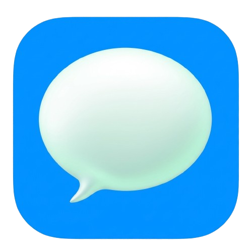

<div align="center">



# ChatApp

**A real-time, iMessage-inspired chat application with rich media sharing, theme customization, and presence indicators.**

[](https://react.dev)
[](https://vite.dev)
[](https://nodejs.org)
[](https://expressjs.com)
[](https://socket.io)
[](https://www.mongodb.com)
[](https://tailwindcss.com)
[](https://www.docker.com)

</div>

---

## Table of Contents

- [Overview](#-overview)
- [Screenshots](#-screenshots)
- [Features](#-features)
- [Tech Stack](#-tech-stack)
- [Project Structure](#-project-structure)
- [Getting Started](#-getting-started)
- [API Reference](#-api-reference)
- [Docker Deployment](#-docker-deployment)
- [Roadmap](#-roadmap)
- [License](#-license)

---

## Overview

ChatApp is a full-stack instant messaging application built as a **monolith** that runs a Vite-powered React SPA alongside an Express REST + Socket.IO real-time API from a single Node.js server.

The UI takes heavy design inspiration from classic Apple Messages — conversation cards, rounded chat bubbles, wallpaper backdrops, and a light/dark theme that adapts to your system. Authentication is fully handled by **Clerk** (including Google/GitHub/OAuth flows), and media uploads are streamed through **ImageKit** for on-the-fly optimization.

---

## Screenshots

| Authentication | Chat Interface |
| --- | --- |
|  |  |

| Conversation View | Customization & Settings |
| --- | --- |
|  |  |

---

## Features

- **Real-time 1-on-1 messaging** — messages delivered instantly over Socket.IO, no page refresh required.
- **Online presence** — live green-dot indicators next to users who are currently online.
- **Image & video sharing** — attach media in the composer; uploads are stored on ImageKit with URL-based transformations for responsive delivery.
- **Conversation-based sidebar** — recent chats are aggregated via MongoDB pipelines and sorted by the latest activity.
- **Clerk-powered authentication** — secure sign-in/up with support for OAuth providers, session handling, and user profile sync via webhooks.
- **13 built-in wallpapers** — switch chat backdrops from macOS-style desktop wallpapers to abstract radial gradients.
- **HeroUI theme presets** — swap accent palettes and toggle light/dark modes instantly.
- **Typing-keystroke sounds** — playful macOS-style typewriter clicks (toggleable, persisted to localStorage).
- **Fully responsive** — adaptive sidebar layout with a mobile-first experience.
- **Toast notifications** — smooth success/error feedback via react-hot-toast.
- **Dockerized deployment** — single multi-stage Docker build produces one production image.

---

## Tech Stack

### Frontend

<div align="center">


</div>

### Backend

<div align="center">


</div>

### DevOps & Tooling

<div align="center">


</div>

---

## Project Structure

```
chatapp/
├── backend/                      # Express + Socket.IO API
│   ├── src/
│   │   ├── controllers/
│   │   │   ├── auth.controller.js
│   │   │   └── message.controller.js
│   │   ├── lib/
│   │   │   ├── cron.js           # Self-ping health-check job
│   │   │   ├── db.js             # MongoDB connection
│   │   │   ├── imagekit.js       # ImageKit upload helper
│   │   │   └── socket.js         # Socket.IO server + online map
│   │   ├── middleware/
│   │   │   ├── auth.middleware.js
│   │   │   └── upload.middleware.js
│   │   ├── models/
│   │   │   ├── message.model.js
│   │   │   └── user.model.js
│   │   ├── routes/
│   │   │   ├── auth.route.js
│   │   │   └── message.route.js
│   │   ├── seeds/user.seed.js    # Seed demo users
│   │   ├── webhooks/
│   │   │   └── clerk.webhook.js  # Clerk user sync
│   │   └── index.js
│   ├── .env
│   └── package.json
│
├── frontend/                     # React SPA (Vite)
│   ├── public/
│   │   ├── auth.png
│   │   ├── logo.png
│   │   └── wallpapers/           # 13 wallpaper assets
│   ├── src/
│   │   ├── components/
│   │   │   ├── auth/             # Auth layout pieces
│   │   │   └── chat/             # Sidebar, bubbles, composer...
│   │   ├── context/              # Theme + Wallpaper providers
│   │   ├── data/                 # Wallpapers & theme presets
│   │   ├── hooks/                # Scroll, sound, media, auth hooks
│   │   ├── lib/                  # axios, imagekit url helpers
│   │   ├── pages/
│   │   │   ├── AuthPage.jsx
│   │   │   └── ChatPage.jsx
│   │   ├── store/                # Zustand stores (auth/chat)
│   │   ├── App.jsx
│   │   └── main.jsx
│   ├── .env
│   └── package.json
│
├── Dockerfile                    # Multi-stage production build
└── .dockerignore
```

---

## Getting Started

### Prerequisites

- [Node.js](https://nodejs.org) >= 20
- [npm](https://www.npmjs.com)
- A [MongoDB](https://www.mongodb.com/atlas) instance (local or Atlas)
- A [Clerk](https://clerk.com) application (publishable key + webhook secret)
- An [ImageKit](https://imagekit.io) account (for media uploads)

### 1. Clone & install dependencies

```bash
git clone <your-repo-url>
cd chatapp

cd backend
npm install

cd ../frontend
npm install
```

### 2. Configure environment variables

Create a `.env` in **`backend/`**:

```env
PORT=3000
MONGO_URI=mongodb://localhost:27017/chatapp
FRONTEND_URL=http://localhost:5173
CLERK_WEBHOOK_SIGNING_SECRET=whsec_your_clerk_secret
IMAGEKIT_PRIVATE_KEY=your_private_key
```

Create a `.env` in **`frontend/`**:

```env
VITE_CLERK_PUBLISHABLE_KEY=pk_test_your_publishable_key
```

> **Note:** Both `.env` files are git-ignored. Never commit secrets.

### 3. Run in development

```bash
# Terminal 1 — Backend on http://localhost:3000
cd backend
npm run dev

# Terminal 2 — Frontend on http://localhost:5173
cd frontend
npm run dev
```

Open <http://localhost:5173>, sign in with Clerk, and start chatting.

### 4. (Optional) Seed demo users

```bash
cd backend
npm run db:seed
```

---

## API Reference

All protected routes rely on Clerk sessions (resolved via `clerkMiddleware`).

| Method | Endpoint | Description | Auth |
| --- | --- | --- | --- |
| `GET` | `/health` | Health/liveness probe for uptime monitors | No |
| `POST` | `/api/webhooks/clerk` | Receives `user.created` / `user.updated` / `user.deleted` events | Signature |
| `GET` | `/api/auth/check` | Returns the authenticated user | Yes |
| `GET` | `/api/messages/users` | Users available for the sidebar | Yes |
| `GET` | `/api/messages/conversations` | Recent conversations, newest first | Yes |
| `GET` | `/api/messages/:id` | Message history with a specific user | Yes |
| `POST` | `/api/messages/send/:id` | Send text/image/video (`multipart/form-data` with `media`) | Yes |

### Socket.IO events

| Event | Direction | Payload |
| --- | --- | --- |
| `connection` | Client → Server | `query.userId` |
| `getOnlineUsers` | Server → Client | `string[]` of online user IDs |
| `newMessage` | Server → Client | The persisted `Message` document |

---

## Docker Deployment

A single multi-stage `Dockerfile` builds the Vite SPA, bundles the Express API, and serves everything from one Node runtime (API + static files).

```bash
# Requires a build arg for the public Clerk key
docker build \
  --build-arg VITE_CLERK_PUBLISHABLE_KEY=pk_test_your_key \
  -t chatapp .

docker run -p 3001:3001 \
  -e PORT=3001 \
  -e MONGO_URI=mongodb://host.docker.internal:27017/chatapp \
  -e FRONTEND_URL=http://localhost:3001 \
  -e CLERK_WEBHOOK_SIGNING_SECRET=whsec_your_secret \
  -e IMAGEKIT_PRIVATE_KEY=your_private_key \
  chatapp
```

The container listens on **port 3001**, serves the SPA on `/`, exposes the API on `/api`, and self-pings its `/health` endpoint via a cron job every 14 minutes.

---

## Roadmap

- [ ] Read receipts / message delivery status
- [ ] Typing indicators
- [ ] Group chats
- [ ] Message search across conversations
- [ ] End-to-end message encryption

---


<div align="center">

Built with React, Express, MongoDB, Socket.IO, and Docker. Happy chatting!

</div>